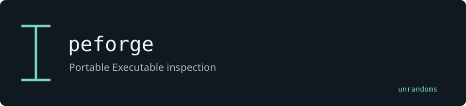

# peforge

Reads PE structures using the pelite library. This fork adds a peforge command, import hashing and a parser fuzz target.

Maintained by [unrandoms](https://github.com/unrandoms), derived from [CasualX/pelite](https://github.com/CasualX/pelite).

## Fork-specific work

- [`src/bin/peforge.rs`](src/bin/peforge.rs)
- [`src/imphash.rs`](src/imphash.rs)
- [`fuzz/fuzz_targets/parse_pe.rs`](fuzz/fuzz_targets/parse_pe.rs)

## Validation and limits

The library crate remains named pelite to preserve its API. The peforge command is the fork-specific entry point.

This documentation update does not certify all inherited features. The [archived reference](UPSTREAM_README.md) describes the original ecosystem; its package names and release links may target upstream rather than this fork.

## Credits

See [CREDITS.md](CREDITS.md) for the distinction between the original implementation and this fork's adaptations. Original licenses and copyright notices remain in the repository.
